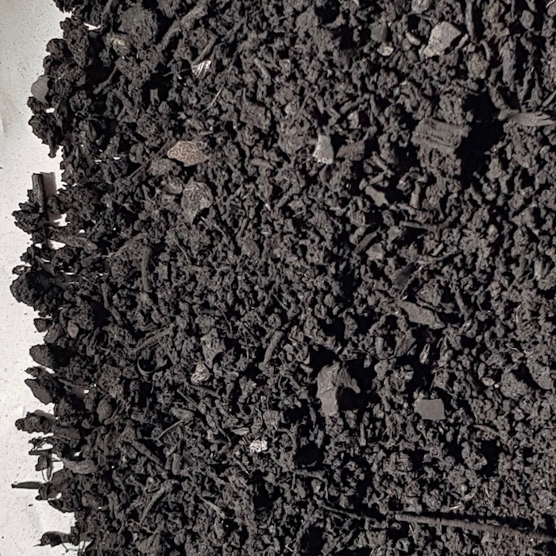

### ¿Qué es el Biochar?
El Biochar es una forma de carbón creado calentando biomasa, como residuos agrícolas, astillas de madera o residuos de cultivos, en un entorno de bajo contenido de oxígeno a través de un proceso llamado pirólisis. La pirólisis ocurre a altas temperaturas, generalmente entre 350 y 700 grados Celsius, lo que elimina los compuestos volátiles y deja un producto estable rico en carbono conocido como Biochar.

Esta sustancia posee propiedades extraordinarias que tienen un inmenso potencial para el almacenamiento de carbono, mejorar la salud del suelo y los árboles, y aumentar los rendimientos de los cultivos para los agricultores. 

En éste taller práctico de 4 horas de duración os enseñaremos cómo lo fabricamos, lo activamos y lo usamos en   Torre Escribana. .

{: .box-success}
Para pedir más información y preinscribirte escríbenos a **torre.escribana (arroba) gmail.com**

 